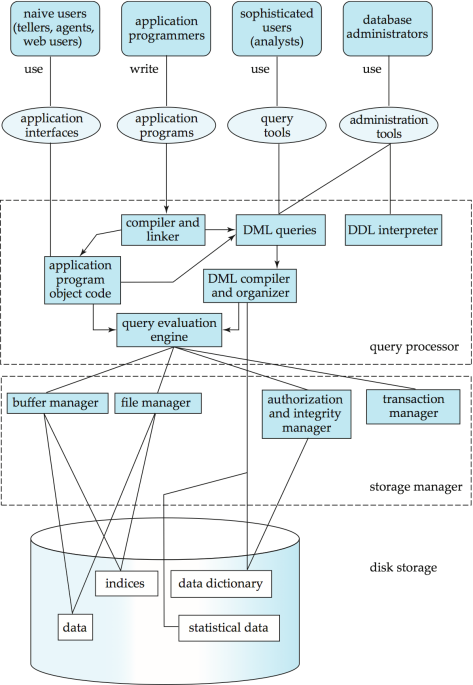
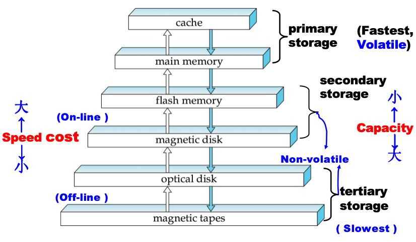
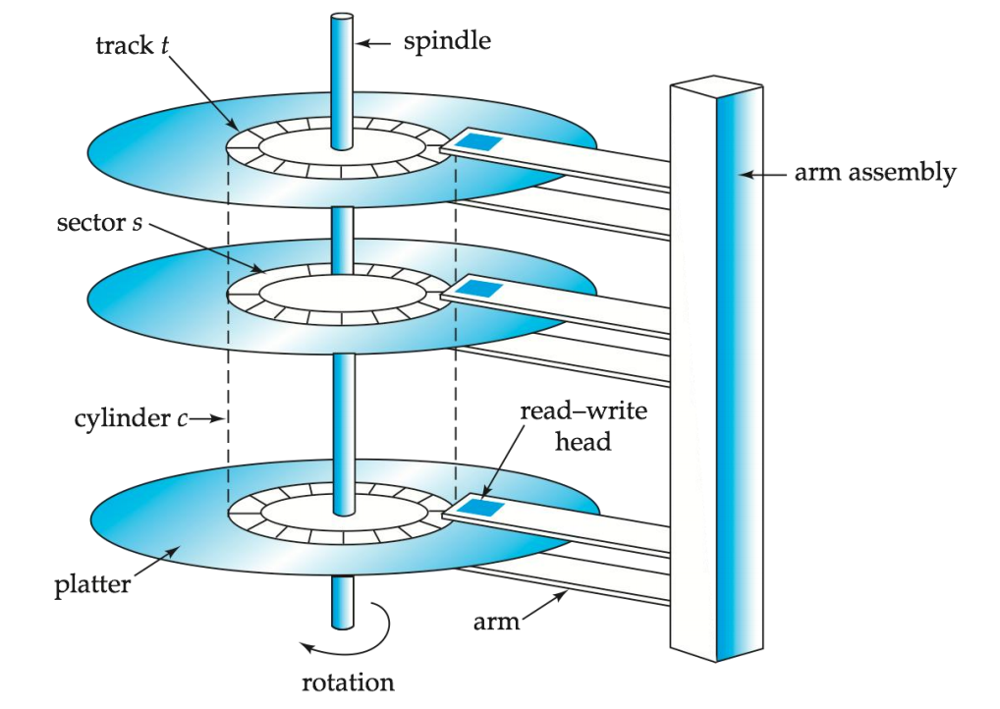
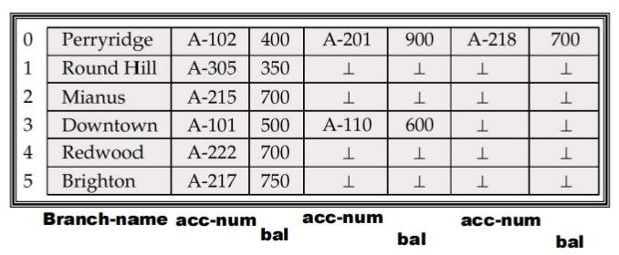
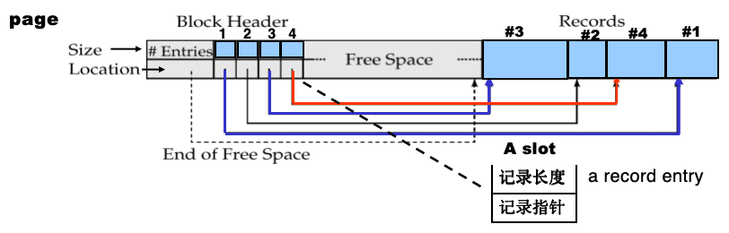
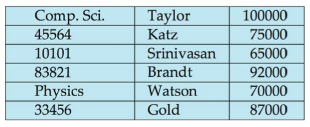

# 存储与数据结构

!!! info "存储管理器"
    1. **存储管理器**负责在数据库中存储的低层数据与系统中的应用程序及提交的查询之间提供接口

    - 与文件管理器交互
    - 高效地存储、检索和更新数据

    2. **存储管理器包括**事务管理器、授权与完整性管理器、文件管理器、缓冲区管理器
    3. **查询处理器包括** DDL 解释器、DML 编译器和查询处理

    ??? abstract "数据库系统结构"
        {style="width:50%;display: block;margin: 20px auto"}

---
## 物理存储介质

1. **存储介质可按以下标准分类**：
    - **速度**：访问数据的快慢
        - **由快到慢**：高速缓存、主存储器、快闪存储器、磁盘、光存储、磁带存储
    - **成本**：单位数据的造价
    - **可靠性**：电源故障或系统崩溃时的数据丢失情况；存储设备的物理损坏（RAID）
        - **易失性存储**：电源断开时内容丢失 **e.g.** DDR2, SDR
        - **非易失性存储**：电源断开后内容依然保留 **e.g.** 二级存储和三级存储以及**电池备份的主存储器**

2. **Cache**：最快且最昂贵的存储形式，具有**易失性**，由计算机系统硬件管理
3. **Main Memory**：访问快速，容量通常太小（太贵），具有**易失性**
4. **Flash Memory**：具有**非易失性**

    - 读取速度大致与主存储器一样快，但**写入速度较慢**，擦除速度更慢
    - 数据**只能在某一位置写入一次**，但该位置可以被擦除并再次写入
    - **应用**：广泛用于嵌入式设备 **e.g.** 数码相机、手机和 USB 闪存盘

5. **Magnetic Disks**：

    - **长期存储数据的主要介质**，通常存储整个数据库
    - 数据必须从磁盘移动到主存储器才能被访问，并在处理后写回磁盘存储，**访问速度比主存储器慢得多**
    - **直接访问**：可以按任意顺序读取磁盘上的数据
    - **非易失性**：在电源故障和系统崩溃时依然存续

6. **Optical storage**

    - **非易失性**，使用激光从旋转的盘片上光学读取数据
    - **读写速度比磁盘慢**

7. **Tape storage**

    - **非易失性**，主要用于**备份**（用于从磁盘故障中恢复）和归档数据
    - **顺序访问**：比磁盘慢得多
    - 极高容量，存储成本比磁盘便宜得多（但是驱动器很贵）

8. <mark>**存储层级**</mark>

    {style="width:50%;display: block;margin: 20px auto"}

    - **一级存储**：高速缓存、主存储器（速度最快的介质，但具有**易失性**）
    - **二级存储**（辅助存储/联机存储）：快闪存储器、磁盘（非易失性，具有中等强度的访问速度）
    - **三级存储**（脱机存储）：磁带、光存储（非易失性，访问速度慢）

---
### 磁盘
1. **结构**

    {style="width:50%;display: block;margin: 20px auto"}

    - **读写磁头** (Read-write head)
        - 放置在非常靠近盘片表面的位置（几乎接触到）
        - 通过电磁方式读取或写入编码信息
    - 盘片（platter）表面被划分为**环形磁道** (Tracks)
    - 每条磁道被划分为**扇区** (Sectors)
        - <mark>扇区是可以读取或写入的**最小数据单位**</mark>
        - 扇区大小通常为 512 字节
    - **柱面**(Cylinder) $i$ 由所有盘片的第 $i$ 条磁道组成
    - **磁盘控制器**：计算机系统与磁盘驱动器硬件之间的接口
        - 为每个扇区计算并附加校验和，以验证读回的数据是否正确
        - **确保成功写入**：通过在写入后读回扇区来验证
        - 执行坏扇区的重映射：将该扇区从逻辑上映射到预留的物理扇区，并且重映射被记录在磁盘或其他非易失性存储器中

2. **磁盘子系统** (Disk Subsystem)：多个磁盘通过控制器连接到计算机系统
3. **磁盘接口标准族**：ATA 标准系列、SATA、SCSI 标准系列、SAS
4. **磁盘性能测试**
    - **访问时间**：从发出读写请求到数据传输开始所需的时间 <mark class="orange">Access Time = Seek Time + Rotational Latency</mark>
        - 寻道时间：将磁臂重新定位到正确磁道所需的时间
        - 旋转等待时间：等待待访问的扇区出现在磁头下方所需的时间（**平均旋转等待时间是最坏情况的一半**）
    - <mark>**数据转移速率 Data-transfer rate**</mark>：从磁盘检索数据或将数据存储到磁盘的速率
    - **平均故障时间**：磁盘预期能够无故障连续运行的平均时间（MTTF 随磁盘老化而降低）
5. **磁盘访问优化**
    - <mark>**块** (Block)：来自单个磁道的**连续扇区序列**（磁盘和主存之间的数据传输以块为单位）</mark>
    - **磁盘臂调度算法**：对等待访问磁道的请求进行**排序**，使磁盘臂的移动最小化
        - <mark>**电梯算法**：磁盘臂向一个方向移动，处理该方向上的下一个请求，直到该方向没有更多请求，然后**反转方向**并重复</mark>
    - **文件组织**：通过组织数据块以对应数据的访问方式，来优化块访问时间（可能会产生**碎片**）
    - **非易失性写缓冲区**：通过立即将块写入非易失性 RAM 缓冲区来加速磁盘写入，当磁盘没有其他请求或请求已挂起一段时间后，控制器再写入磁盘
    - **日志磁盘**：专门用于顺序写入块更新日志的磁盘

### \* RAID
1. **定义**：独立磁盘冗余阵列

2. **优势**
    - <mark>通过**并行**使用多个磁盘实现**高容量和高速度**</mark>（通过将数据拆分到多个磁盘来提高传输速率）
        - **比特级拆分**：将每个字节的位拆分到多个磁盘上
        - **块级拆分**：对于 $n$ 块磁盘，文件的第 $i$ 块进入第 $(i \mod n) + 1$ 块磁盘
    - <mark>通过**冗余**存储数据实现**高可靠性**</mark>，以便在磁盘故障时仍能恢复数据
        - **e.g.** 镜像：复制每一块磁盘（一个逻辑磁盘由两块物理磁盘组成）

!!! quote "RAID 级别"
    1. **等级**
        - RAID 0 级：块拆分；无冗余
        - RAID 1 级：带块拆分的镜像磁盘
        - RAID 2 级：带比特拆分的内存风格纠错码 (ECC)
        - RAID 3 级：位交错校验
        - RAID 4 级：块交错校验
        - RAID 5 级：块交错分布式校验
        - RAID 6 级：P+Q 冗余方案
    2. **选择**：RAID 0 仅在数据安全不重要时使用，2 级和 4 级从不使用，3 级不再使用，6 级很少使用，因此仅在 1 级和 5 级之间选择
        - 1 级提供比 5 级好得多的写入性能；1 级的存储成本高于 5 级
        - <mark class="orange">5 级适用于**更新率低、数据量大**的应用；1 级适用于所有其他应用</mark>

---
## 存储访问
1. **blocks**：
    - 数据库文件在逻辑上被划分为**固定长度**的存储单位，称为块
    - 块是数据库系统中存储分配和数据传输的**基本单位**
2. **缓冲区** (Buffer)：主存储器中可用于存储磁盘块副本的部分（为了最小化磁盘与内存之间的**块传输次数**）
3. **缓冲区管理器** (Buffer manager)：负责在主存储器中分配缓冲区空间的子系统
    - **缓冲区替换策略**：LRU（最近最少使用）、MRU（最近最常使用策略）
    - <mark>**Pinned block**</mark>：不允许写回磁盘的内存块
    - **Dirty bit**：页面是否被修改
    - <mark>**Pin count**</mark>：有多少事务/操作正在使用
    - **立即丢弃策略**：一旦处理完该块的最后一个元组，立即释放该块占用的空间

---
## 文件组织
1. 数据库以**文件集合**的形式存储
    - 每个文件是一个记录序列，一条记录是一个字段序列
    - <mark>记录有两种**类型**：定长记录、变长记录</mark>
2. **定长记录**：
    - **优点**：方法简单
    - **删除记录** $i$ 备选方案：
        - 方法 1：将记录 $i + 1, \dots, n$ 移动到 $i, \dots, n - 1$
        - 方法 2：将记录 $n$ 移动到 $i$
        - 方法 3：不移动记录，而是将所有**空闲记录链接在一个空闲列表**上（空间效率较高）

    ??? quote "Example"
        {style="width:80%;display: block;margin: 20px auto"}

3. **变长记录**：
    
    {style="width:80%;display: block;margin: 20px auto"}

    - <mark>**存储**：定长属性区 + 变长属性 (offset, length) + 实际数据</mark>
    - <mark>**分槽页结构** </mark>：一种页内记录组织方式
        - <mark>头部</mark>包含记录条目数、块内空闲空间的**末尾地址**、
        - <mark>槽目录：(offset, length)</mark>
        - RID = (page_id, slot_id)
        - <mark>记录可以在 page 内移动，让记录连续存放，消除页内碎片</mark>
        - **双向增长**：槽目录从页首向后长，记录数据从页尾向前长，中间是空闲空间
    - **表示方式**：
        - **Fixed-length Representation**：每条记录都分配最大可能长度
        - **Pointer Method**：把一个变长记录拆成多个固定长度片段，用指针串起来

---
## \* 文件中记录的组织

1. **堆文件/流水文件**：记录可以放在文件中任何有空间的地方
2. **顺序文件**：根据每条记录的**搜索码**的值，按顺序存储记录
    - <mark>**指针链**</mark>：记录之间通过指针相连，维护逻辑顺序
    - **搜索码**：任何属性或属性组合都可以作为搜索码，<mark>不一定是主键</mark>，但通常选择最常用于范围查询的属性
    - **定期重组**：因为顺序扫描变慢
3. **散列/哈希文件**：对每条记录的某些属性**计算哈希函数**，结果指定记录应放置在文件的哪个块中
4. **聚集文件组织**：几个不同关系的记录可以存储在同一个文件中（以减少 I/O）
    - **缺点**：不利于单独关系的查询（可以添加指针链来链接特定关系的记录）

    !!! quote "Example"
        将特定的系及其对应的讲师记录物理存储在一起

        {style="width:50%;display: block;margin: 20px auto"}

---
## \* 数据字典存储 

1. **元数据** (Metadata)：关于数据的数据，存储数据库的结构、约束及运行状态
2. **物理表示形式**
    - 磁盘表示：采用关系型表结构存储
    - 内存表示：采用专为高效访问设计的特殊数据结构（如哈希表或树）