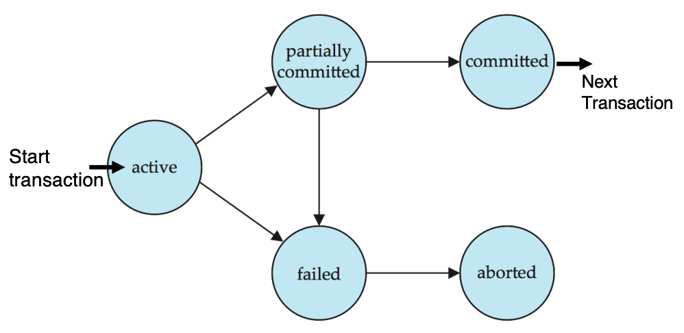
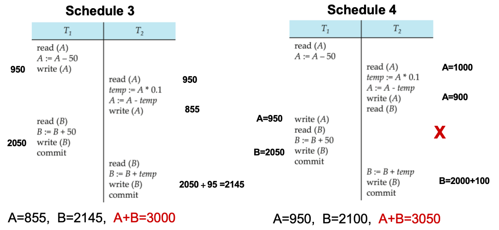
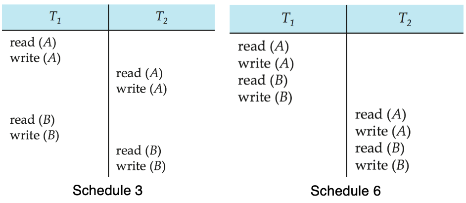
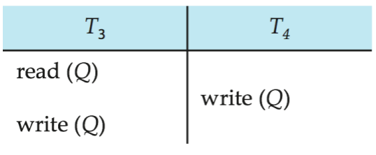
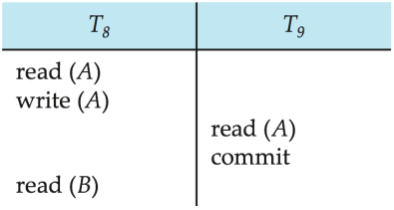
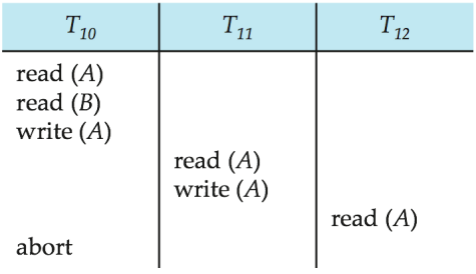

# 事务

!!! info "INFO"
    对于 DBMS，必须解决两个主要问题：

    1. 多个用户或多个程序**并发执行**
    2. 各种**故障** **e.g.** 硬件故障、系统崩溃

1. **事务**：程序执行的一个单元，它访问并可能更新多个数据项
    1. 通常，一个事务**由若干 SQL 语句组成**，并以 **commit 或 rollback** 结束
    2. 事务必须看到一致的数据库
2. **目的**：并发执行时，保持数据库的正确性、一致性和完整性
3. 事务执行**过程中**数据库可能**暂时不一致**，但事务**提交时**数据库必须**一致**
4. **ACID 特性**：为保持数据完整性，数据库系统必须保证：
    1. **原子性 Atomicity**：事务的所有操作要么全部反映到数据库中，要么全部不反映
    2. **一致性 Consistency**：事务在**隔离执行**时应保持数据库一致性
    3. **隔离性 Isolation**：多个事务并发执行时，每个事务都不应感知其他并发事务，**中间结果必须对其他事务隐藏**
    4. **持久性 Durability**：事务成功完成后，即使发生**系统故障**，其对数据库的修改也必须保留

## 事务状态

{style="width:60%;display: block;margin: 20px auto"}

1. **Active 活动状态**：初始状态，事务**执行期间**处于该状态
2. **Partially committed 部分提交状态**：最后一条语句执行后，此时结果数据可能仍在**内存 buffer** 中
3. **Failed 失败状态**：发现无法继续正常执行后进入
4. **Aborted 中止状态**：事务回滚后，数据库恢复到事务**开始前**状态，中止后有两种选择：
    1. **重启事务**：只有不存在内部逻辑错误时才可以
    2. **杀死事务**
5. **Committed 已提交状态**：事务成功完成后进入

## 原子性与持久性
1. 数据库系统的**恢复管理组件**负责支持原子性和持久性
2. **影子数据库方案**：简单
    1. 所有更新都在**新创建的数据库副本**上完成
    2. 原始副本（即影子副本）不被修改，由 **`db_pointer`** 指向
    3. **如果中止**：只需删除新副本
    4. **如果提交**：
        1. 将新副本在内存中的所有页写入磁盘
        2. 将 `db_pointer` 改为指向新副本，使其成为当前副本，同时删除旧副本
    5. **缺点**：对大型数据库极其低效，执行单个事务需要复制整个数据库

## 并发执行
1. **优点**：
    1. 提高处理器和磁盘利用率，从而**提高事务吞吐量**（一个事务使用 CPU 时，另一个事务可以读写磁盘）
    2. **降低事务平均响应时间**：短事务不必等待长事务完成
2. **缺点**：可能破坏一致性
3. **并发控制机制**：实现隔离性的机制，即控制并发事务之间的交互，**防止破坏数据库一致性（DBMS 的重要工作）**
4. **调度**：表示并发事务中各指令按时间顺序执行的序列
    1. 一组事务的调度必须包含这些事务的所有指令
    2. 必须保持每个事务**内部指令的原有顺序**
5. **调度方式**：
    1. **串行调度 Serial**：执行完一个事务后，再执行下一个事务（**一定保持一致性但是低效**）
    2. **并发调度 Concurrent**
        
        !!! warning "WARNING"
            调度 4 没有保持 A+B 的值，因此不一致，是一个坏调度

            {style="width:60%;display: block;margin: 20px auto"}

## 可串行化
Serializability

1. **基本假设**：每个事务都保持数据库一致性
2. 如果一个可能并发的调度等价于某个串行调度，则**该调度是可串行化的**
3. **冲突指令**：事务 Ti 的指令 li 和事务 Tj 的指令 lj 冲突，当且仅当二者访问同一数据项 Q，且**至少有一个指令写 Q**
    
    !!! success "冲突操作的执行顺序不可交换；不冲突操作可以交换顺序"

4. **冲突可串行化**
    1. 如果调度 S 可以通过一系列**“不冲突指令交换”**转换为调度 S'，则称 S 和 S' 是**冲突等价的**
    2. 如果调度 S 与某个**串行调度冲突等价**，则 S 是**冲突可串行化的**

    !!! example "冲突可串行化"
        1. 调度 3 可以通过一系列不冲突指令交换，转换为调度 6 ；调度 6 是一个串行调度，其中 T2 在 T1 之后执行；因此，调度3是冲突可串行化的

            {style="width:60%;display: block;margin: 20px auto"}
        
        2. **不可串行化**
            
            {style="width:30%;display: block;margin: 20px auto"}

!!! info "视图可串行化"
    具体内容见 PPT p28-29

## 可恢复性
1. **可恢复调度**：如果事务 Tj 读取了事务 Ti 之前写入的数据项，则 Ti 的 commit 操作必须出现在 Tj 的 commit 操作**之前**

    !!! warning "WARNING"
        **如果 T9 在读取后立即提交，则下面的调度不可恢复**：
        
        1. 如果 T8 中止，数据库必须把 A 恢复成原来的值
        2. 但 T9 已经基于错误的 A 进行了计算并提交
        3. T9 的结果已经永久写入数据库，甚至已经返回给用户
        4. **现在无法仅靠回滚 T8 来恢复一致状态**

        {style="width:30%;display: block;margin: 20px auto"}

2. **Cascading rollback 级联回滚**：一个事务失败导致一系列事务回滚（可能导致大量工作被撤销）
    
    !!! example "EXAMPLE"
        1. 考虑下方调度，其中所有事务都尚未提交，因此该调度是**可恢复的**
        2. 如果 T10 失败，**T11 和 T12 也必须回滚**
        
        {style="width:30%;display: block;margin: 20px auto"}

3. **无级联调度**：对于任意事务 Ti 和 Tj，如果 Tj 读取了 Ti 之前写入的数据项，则 **Ti 的 commit 操作必须出现在 Tj 的 read 操作之前**
    1. 每个无级联调度也都是**可恢复的**
    2. **不会产生级联回滚**
    3. **最好将调度限制为无级联调度**

!!! info "隔离性的实现"
    为了数据库一致性，调度必须是**冲突可串行化或视图可串行化**，并且是**可恢复的**，最好还是**无级联的**

!!! abstract "SQL 中的事务定义"
    1. 数据操纵语言必须包含一种结构，用于指定构成事务的一组操作
    2. 在 SQL 中，事务是隐式开始的
    3. **SQL 中事务的结束方式**：
        1. commit work：提交当前事务，并开始一个新事务
        2. rollback work：使当前事务中止
    4. 在几乎所有数据库系统中，默认情况下每条 SQL 语句如果成功执行，也会**隐式提交**
    5. 可以通过数据库指令关闭隐式提交，例如 JDBC 中：`connection.setAutoCommit(false)`

## 可串行化测试
1. **优先图/前驱图**：一个有向图，顶点是事务名 
2. **一个调度是冲突可串行化的，当且仅当它的优先图无环**
    1. 存在 $O(n²)$ 时间的**环检测算法**，其中 $n$ 是图中顶点数
    2. **更好的算法复杂度**为 $O(n+e)$，其中 $e$ 是边数
3. 如果优先图无环，可以通过**拓扑排序得到串行化顺序**

!!! info "INFO"
    | 对比项     | 并发控制         | 可串行化测试    |
    | ------- | ------------ | --------- |
    | 目的      | 防止产生错误调度     | 判断调度是否正确  |
    | 工作时机    | 调度生成过程中      | 调度生成之后    |
    | 本质      | 预防           | 检测        |
    | 方法      | 加锁、时间戳、MVCC等 | 优先图、冲突分析  |
    | 数据库实际采用 | ✓            | ✗（很少在线使用） |
