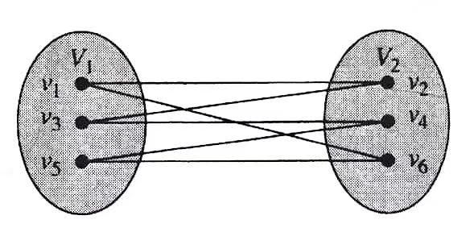
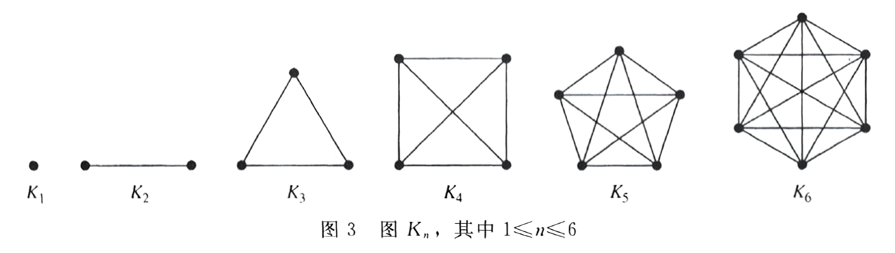
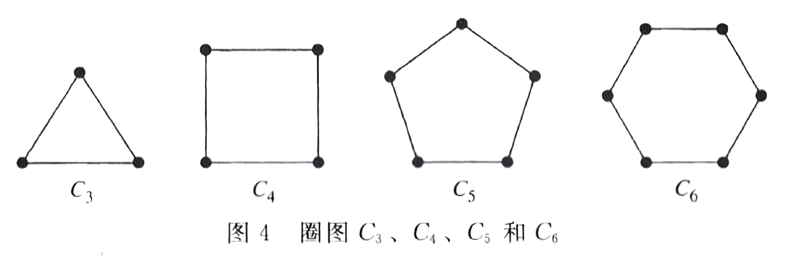
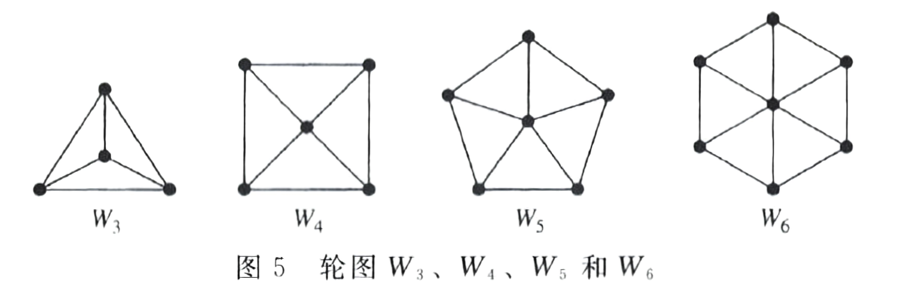
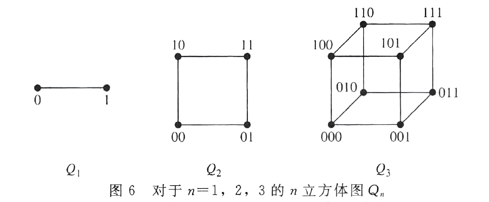
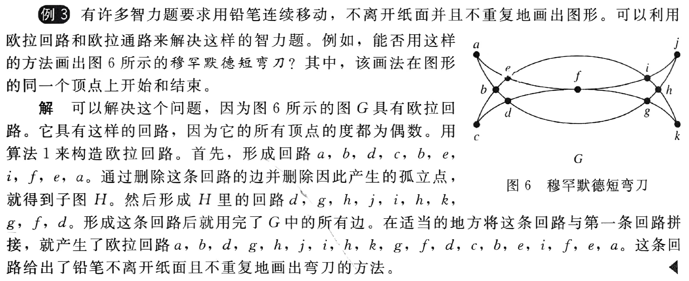
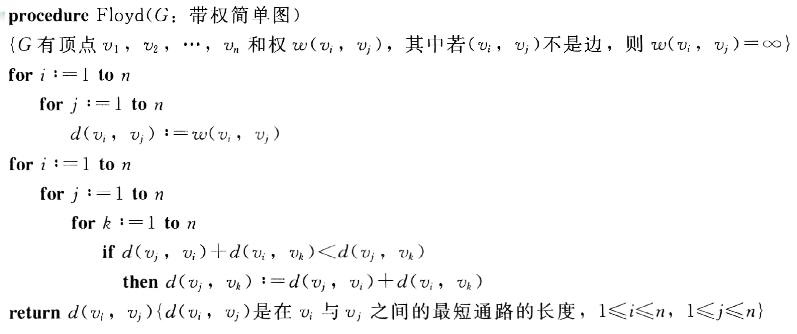
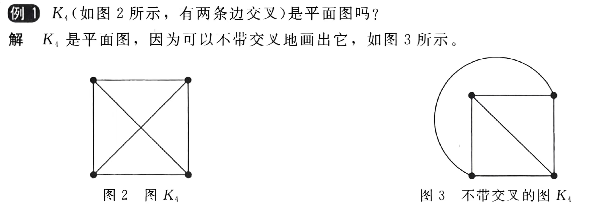
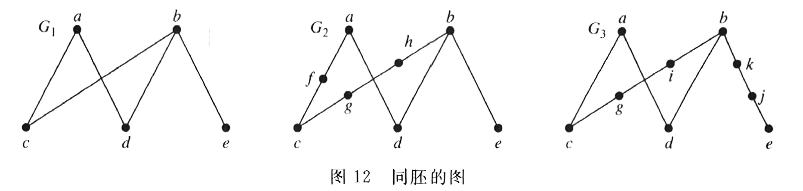
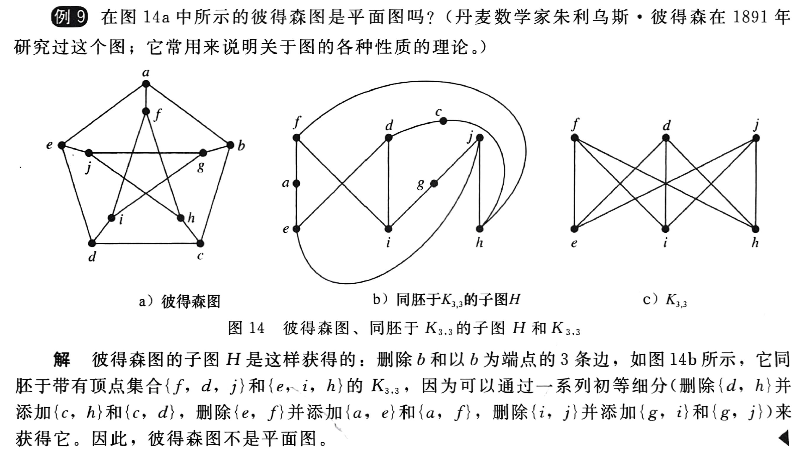

## English
|English|Chinese|English|Chinese|English|Chinese|
|:--:|:--:|:--:|:--:|:--:|:--:|
|bipartite|二分图|adjacency matrix|邻接矩阵|isomorphic|同构的|
|match|匹配|chromatic number|着色数|mixed graph|混合图|
|simple graph|简单图|multigraph|多重图|pseudograph|伪图|
|cycle|圈图|wheel|轮图|cube|立方体图|
|Floyd algorithm|弗洛伊德算法|planar|平面图|region|面|
|Eular path|欧拉通路|circuit|回路|Hamilton|哈密顿|
|elementary subdivision|初等细分|homeomorphic|同胚|||

---
## 基础术语
1. **定义**：

- **二分图**：简单图分成不相交的两部分，每条边都连接这两部分
  
    {style="width:50%;display: block;margin: 20px auto"}

- $N(A)$ ：图的顶点集的子集 $A$ 相邻的所有顶点组成的集合
- **完全匹配**：在二分图 \(G=(V, E)\) 划分成 \((V_1, V_2)\) 情况下，若 \(V_1\) 中每个顶点都是匹配边的端点（即 \(V_1\) 中顶点都被匹配到），或者匹配边的数量 \(\vert M\vert\) 等于 \(V_1\) 集合顶点的数量 \(\vert V_1\vert\) ，则称匹配 \(M\) 是从 \(V_1\) 到 \(V_2\) 的完全匹配
- **完全二分图** $K_{n,m}$

2. **图的分类**
    
| 类型 | 边的方向 | 多重边 | 自环 |
|:--:|:--:|:--:|:--:|
| 简单图 | 无向 | 否 | 否 |
| **多重图**| 无向 | 是 | **否** |
| 伪图 | 无向 | 是 | 是 |
| 简单有向图  | 有向| 否 | 否 |
| **有向多重图**  | 有向 | 是 | **是** |
| 混合图  | 有向和无向混合 | 是 | 是 | 

3. **特殊的简单图**

- **完全图** $K_n$
  
    

- **圈图** $C_n$
  
    {style="width:80%;display: block;margin: 20px auto"}

- **轮图** $W_n$
  
    {style="width:80%;display: block;margin: 20px auto"}

- **$n$ 立方体图** $Q_n$

    {style="width:70%;display: block;margin: 20px auto"}

### 定理 霍尔婚姻定理
**完全匹配的充分必要条件**

带有二部划分 $(V_1, V_2)$ 的二分图 $G = (V, E)$ 中有一个从 $V_1$ 到 $V_2$ 的完全匹配当且仅当对于 $V_1$ 的所有子集 $A$ ，有 $|N(A)| \geq |A|$

---
## 连通性
### 定理 1 顶点之间的通路数
设 \(G\) 是一个图，该图的邻接矩阵为 \(A\)，顶点顺序为 \(v_1, v_2, \cdots, v_n\)。从\(v_i\)到\(v_j\)长度为\(r\)的不同通路的数目等于\(A^r\)的第\((i, j)\)项，其中\(r\)是正整数

!!! tip "Tips"
    1. 如果一个图是弱连通的，并且每个顶点的出度等于入度，则该图一定是强连通的

---
## 欧拉通路与哈密顿通路
### 欧拉回路和欧拉通路（遍历边）
1. **定义**：

- **欧拉通路**
- **欧拉回路**
- **欧拉图**：具有欧拉回路的图

2. 寻找欧拉回路的**方法**

- 找到一条回路，原图中去掉该回路
- 在去掉回路之后的图中重复上述操作

??? example "Example"
    

#### 定理 1 
含有至少2个顶点的连通多重图具有**欧拉回路**当且仅当它的**每个顶点的度都为偶数**
#### 定理 2
连通多重图**具有欧拉通路但无欧拉回路**当且仅当它**恰有2个度为奇数的顶点**
#### 定理 3 有向图（没有孤立点）
1. **有欧拉回路**
   
- 图为弱连通的
- 每个顶点的出度和入度相同

2. **有欧拉通路但无欧拉回路**
   
- 图为弱连通的
- 除了两个顶点外，其他所有顶点的入度和出度相等
- 两个顶点中一个顶点的入度比出度大1，另一个顶点的出度比入度大1 

### 哈密顿回路和哈密顿通路（遍历点）
- **带有度为1的顶点**的图没有哈密顿回路
- 对于\(n\)个顶点的完全图，哈密顿回路的数量为$\frac{(n - 1)!}{2}$
#### 定理 1 狄拉克定理（充分）
如果 \(G\) 是有 \(n\) 个顶点的简单图，其中 \(n \geq 3\)，并且 \(G\) 中每个顶点的度都至少为 \(\frac{n}{2}\)，则 \(G\) 有**哈密顿回路**

#### 定理 2 欧尔定理（充分）
如果 \(G\) 是有 \(n\) 个顶点的简单图，其中 \(n \geq 3\)，并且对于 \(G\) 中每一对不相邻的顶点 \(u\) 和 \(v\) 来说，都有 \(\text{deg}(u) + \text{deg}(v) \geq n\)，则 \(G\) 有**哈密顿回路**

#### 定理 3 必要条件
若图 \(G\) 有**哈密顿回路** ，则对于顶点集 $V$ 的所有非空子集 $S$ ，$G-S$ 连通分量的数量小于等于 $|S|$

!!! tip "Tips"
    可以用来判断一个图无哈密顿回路

---
## 最短路径问题
### 弗洛伊德算法
- 可以求出加权连通简单图中所有顶点对之间的最短路径长度
- **不能用来构造最短通路**

{style="width:80%;display: block;margin: 20px auto"}

---
## 平面图
- **定义**：
    - **平面图**：在平面中画出一个图，边没有任何交叉
        
        ??? example "Example"
            

    - **面**

### 定理 1 欧拉公式
设 \(G\) 是带 \(e\) 条边和 \(v\) 个顶点的**连通**平面简单图。设 \(r\) 是 \(G\) 的平面图表示中的面数，则 \(r = e - v + 2\)

#### 推论 1
设 \(G\) 是带 \(e\) 条边和 \(v\) 个顶点的**连通**平面简单图，其中 \(v \geq 3\)，则 \(e \leq 3v - 6\)

#### 推论 2
若 \(G\) 是连通平面简单图，则 \(G\) 中有度数不超过 \(5\) 的顶点

#### 推论 3
若连通平面简单图有 \(e\) 条边和 \(v\) 个顶点，\(v\geq3\) 并且没有长度为 \(3\) 的回路，则 \(e\leq2v - 4\)

!!! note "Notice!"
    利用推论证明是否是平面图。

### 定理 2 库拉图斯基定理
1. **定义**

- **同胚**：两个图可以从一个相同的图通过初等细分得到，则这两个图同胚

    

- **初等细分**

2. **定理**

一个图是**非平面图**当且仅当它包含一个同胚于 \( K_{3,3} \)（完全二分图） 或 \( K_5 \) 的子图

??? example "Example"
    

---
## 图着色
- **定义**
    - **简单图的着色**：对每个顶点指定颜色，每对相邻两个顶点的颜色不同
    - **图的着色数**（chromatic number） $\chi(G)$：最少颜色数 

### 定理 1 四色定理
平面图的着色数不超过 \( 4 \)
### 常用结论
1. $\chi(K_n) = n$
2. $\chi(K_{m,n}) = 2$
3. 

\[
\chi(C_n) = 
\begin{cases} 
2, & \text{当 } n \text{ 为正偶数且 } n \geq 4 \text{ 时} \\
3, & \text{当 } n \text{ 为正奇数且 } n \geq 3 \text{ 时}
\end{cases}
\]