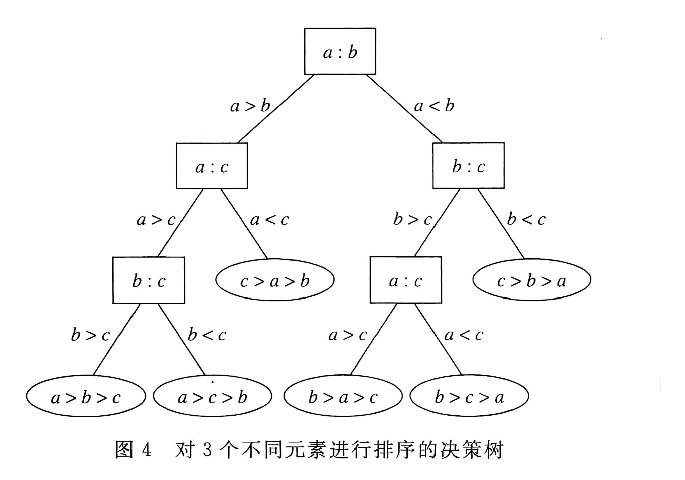
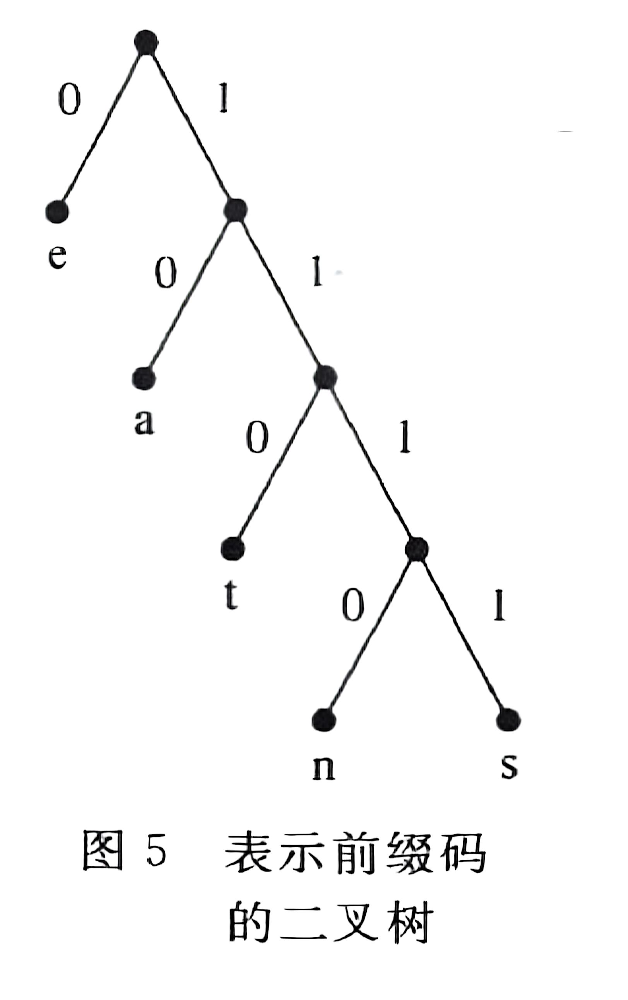
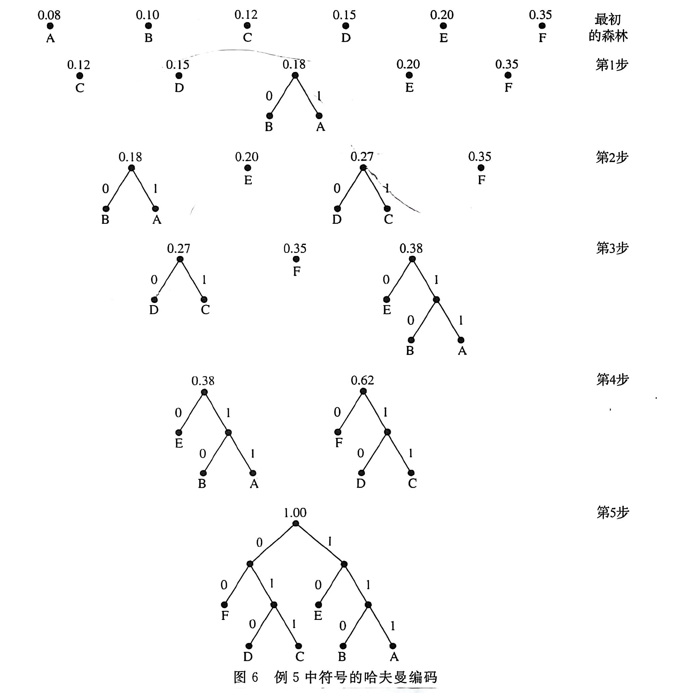

## English
|English|Chinese|English|Chinese|English|Chinese|
|:--:|:--:|:--:|:--:|:--:|:--:|
|flowgraph|流图|source|源点|tink|汇点|
|weak duality|弱对偶性|descendant|后代|||

---
## 树的应用
!!! bug "Notice!"
    注意满二叉树（full）和完全二叉树（complete）的不同！

    - 满二叉树：内部节点的子节点要铺满
    - 完全二叉树：每一层要铺满

### 决策树
**Example:**对3个不同元素进行排序的决策树

{style="width:70%;display: block;margin: 20px auto"}

### 前缀码
**Example：**

{style="width:30%;display: block;margin: 20px auto"}

#### 哈夫曼编码
- **步骤**：
    - 给定n个符号及其频率
    - 构造成n个单个顶点的树，顶点的权等于所标记符号的频率
    - 寻找**权最小**的两个树，合成一个树，根节点的权等于两个树根节点的权之和
    - 并且**具有较大的权**的树作为左子树
    - 重复上述操作

??? note "Example"
    

---
## 扩展：网络流
- **相关定义**
    - **流图**：有源点和汇点的**有向图**
    - **可行流**（s-t Flow）
### 割（cut）
#### 相关定义
1. **割 \( cut(S, T) \)**：将顶点集分成两个不相交的子集 $S$ 和 $T$

- 源点 \( s \in S \)
- 汇点 \( t \in T \)
- 表示为有序对 \( (S, T) \)，且 \( S \cup T = V \)，\( S \cap T = \emptyset \)

2. **割 \( (S, T) \) 的容量 \( Cap(S, T) \)**：所有从 $S$ 到 $T$ 的边的容量之和

3. **割 \( (S, T) \) 的净流量 \( Flow(S, T) \)**：所有从 \( S \) 到 \( T \) 的边的流量减去从 \( T \) 到 \( S \) 的边的流量

#### 流量值引理
穿过割的净流量等于从源点 \( s \) 流出的流量

\[
Flow(S, T) = \sum_{e\ out\ of\ A}f(e)-\sum_{e\ in\ to\ A}f(e) = v(f)
\]

#### 弱对偶性
流量的值不超过割的容量

\[
v(f)\leq cap(A, B)
\]
    
### 最大流/最小割问题
1. **最小割问题**：找到最小容量的割 \( cut(S, T) \)

2. **最大流最小割定理**：最大流的值等于最小割的容量

!!! note "Notice!"
    找最小割的容量证明是否是最大流！

3. **最小割求解**：找到最大流后，**残差图**中 $s$ 可达的顶点集 $A$ 对应的割 $(A,V−A)$ 即为最小割
