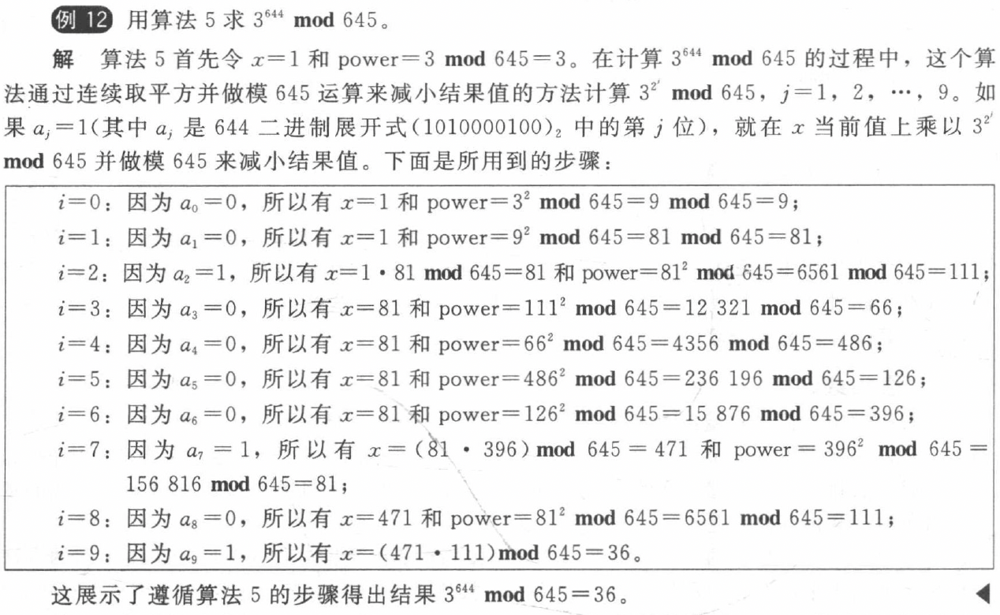

## English
|English|Chinese|English|Chinese|English|Chinese|
|:--:|:--:|:--:|:--:|:--:|:--:|
|prim|素数|composite|合数|congruent|同余的|
|octal|十六进制|hexadecimal|八进制|inverse|逆|
|linear congruence|线性同余方程|pseudoprime|伪素数|primitive root|原根|
|logarithm|对数|encryption|加密|decryption|解密|
|Euclidean|欧几里得|Bezout|贝祖|Eratosthenes|埃拉托斯特尼|

---
## 整除与模
- 定义：
    - 商：$q = a\ \text{div}\ d$
    - 余数：$r = a\ \text{mod}\ d$

### 简单定理
1. 如果 $a \equiv b\ (\,\text{mod}\,m)$，$c \equiv d\ (\,\text{mod}\,m)$，那么 $a+c \equiv b+d\ (\ \text{mod}\ m)$ 并且 $ac \equiv bd\ (\ \text{mod}\ m)$

2. $(a+b)\ \text{mod}\ m = ((a\ \text{mod}\ m)+(b\ \text{mod}\ m))\ \text{mod}\ m$

3. $ab\ \text{mod}\ m = ((a\ \text{mod}\ m)(b\ \text{mod}\ m))\ \text{mod}\ m$

??? abstract "模 m 算术"
    - 加法：$a +_{m} b = (a + b)\ \text{mod}\ m$
    - 乘法：$a \cdot_{m} b= (a \cdot b)\ \text{mod}\ m$
    - 满足结合律、交换律、分配律

### 快速模指数运算
- **问题：**求 $b^n\ \text{mod}\ m$
- **伪代码**

    ```text
    procedure modular exponentiation(b: 整数, n=(aₖ₋₁aₖ₋₂⋯a₁a₀)₂, m: 正整数)
    x := 1
    power := b mod m
    for i := 0 to k-1
        if aᵢ = 1 then x := (x · power) mod m
        power := (power · power) mod m
    return x{x 等于 bⁿ mod m}
    ```

- **步骤：**
    - 现将指数 $n$ 写成二进制
    - 初始化最终结果 $x=1$ ，$power=b$
    - 从低位开始检查每一位 $a_j$**（注意先后顺序）**
        - 分情况讨论：
            - 如果 $a_j=0$，$x$ 保持不变
            - 如果  $a_j=1$，$x=(x\cdot power)\ \text{mod}\ m$
        - $power=power^2\ \text{mod}\ m$
    - 不断重复，直至遍历完所有位

??? example "Example"
    

---
## 素数
- **埃拉托斯特尼筛法**
    - 应用：寻找不超过一个给定整数的所有素数
    - 步骤：在小于给定整数 $n$ 的数中逐步删除可以被小于 $\sqrt{n}$ 的数整除的数
- 记号：
    - 最小公倍数： $gcd(a,b)$
    - 最大公约数： $lcm(a,b)$

### 欧几里得算法
- **引理**：已知 $a=bq+r$，则 $gcd(a,b) = gcd(b,r)$
- **应用**：寻找两个数的最大公约数
- **步骤**：相除取余，直至余数为0

### 定理 1 算数基本定理
每个大于 1 的整数都可以唯一地写为两个或多个素数的乘积，其中素数因子以**非递减**序列排列

### 定理 2 素数定理
当 $x$ 无限增长时，不超过 $x$ 的素数个数与 $x/\ln x$ 之比 $\pi (x)$ 趋近于 1 

### 定理 3 
如果 $a$ 和 $b$ 为正整数，则 $ab = gcd(a,b) \cdot lcm(a,b)$

### 定理 4 贝祖定理
如果 $a$ 和 $b$ 为正整数，则存在整数 $s$ 和 $t$ （贝祖系数）使得 $gcd(a,b) = sa+tb$（贝祖恒等式）

---
## 求解同余方程
- **相关定义**
    - **逆**：如果 $\bar{a}a \equiv 1\ (\text{mod}\ m)$，则称 $\bar{a}$ 为 $a$ 模 $m$ 的逆

### 定理 1 
如果 $a$ 和 $m$ 为**互素**的整数且 $m>1$ 则 $a$ 模 $m$ 的逆**存在**；并且，这个模 $m$ 的逆是**唯一的** 

1. **$\bar{a}$ 的求解方法**

对欧几里得算法寻找 $gcd(a,m)$ 的步骤反向操作，找到贝祖恒等式和贝祖系数

2. **同余方程的求解方法**

**Question**：已知 $ax \equiv b\ (\text{mod}\ m)$，求 $x$

**Answer**：

- 求出 $\bar{a}$ 满足 $\bar{a}a \equiv 1\ (\text{mod}\ m)$
- 根据已知条件，$\bar{a}ax \equiv \bar{a}b\ (\text{mod}\ m)$
- 由$\bar{a}a \equiv 1\ (\text{mod}\ m)$，得$x \equiv \bar{a}b\ (\text{mod}\ m)$

### 定理 2 中国剩余定理
**同余方程组的求解方法**

令\(m_1,m_2,\cdots,m_n\)为大于\(1\)的**两两互素**的正整数，而\(a_1,a_2,\cdots,a_n\)是任意整数。则同余方程组：

$$
x\equiv a_1\ (\text{mod}\ m_1)
$$

$$
x\equiv a_2\ (\text{mod}\ m_2)
$$

$$
\cdots
$$

$$
x\equiv a_n\ (\text{mod}\ m_n)
$$

有唯一的模\(m = m_1m_2\cdots m_n\)的解。（即，存在一个满足\(0\leq x\leq m\)的解\(x\)，而所有其他的解均与此解模\(m\)同余。）

**求解方法**：

1. 要构造一个满足所有方程的解，首先令

$$
M_k = \frac{m}{m_k}, k = 1,2,\cdots,n
$$ 

2. 存在整数\(y_k\)，使得

$$
M_ky_k\equiv 1\ (\text{mod}\ m_k)
$$

求出 $M_k$ 模 $m_k$ 的逆 $y_k$

3. 取和

\[
x = a_1M_1y_1 + a_2M_2y_2+\cdots+a_nM_ny_n
\]

??? example "同余方程组求解"
    **Question:**
    
    同余方程组为：

    $$x\equiv 2\pmod{3}$$

    $$x\equiv 3\pmod{5}$$

    $$x\equiv 2\pmod{7}$$

    **Answer:**

    1. **计算相关参数**
    
    令 \(m = 3\times5\times7=105\)，则
    
    $$M_1=\frac{m}{3}=35$$

    $$M_2=\frac{m}{5}=21$$

    $$M_3=\frac{m}{7}=15$$

    2. **求模逆元**
    
    - 因为 \(35\times2\equiv2\times2\equiv1\pmod{3}\)，所以 \(2\) 是 \(M_1 = 35\) 模 \(3\) 的逆，即 \(y_1 = 2\)。
    - 因为 \(21\equiv1\pmod{5}\)，所以 \(1\) 是 \(M_2 = 21\) 模 \(5\) 的逆，即 \(y_2 = 1\)。
    - 因为 \(15\equiv1\pmod{7}\)，所以 \(1\) 是 \(M_3 = 15\) 模 \(7\) 的逆，即 \(y_3 = 1\)。

    3. **计算同余方程组的解**
    
    根据公式 \(x\equiv a_1M_1y_1 + a_2M_2y_2 + a_3M_3y_3\pmod{m}\)，其中 \(a_1 = 2\)，\(a_2 = 3\)，\(a_3 = 2\)。
    
    \[
    x = 233 \equiv 23\ (\text{mod}\ 105)
    \]

    所以，\(23\) 是该同余方程组的最小正整数解 

### 定理 3 费马小定理
如果**\(p\)为素数**，\(a\)是一个不能被\(p\)整除的整数，则

$$
a^{p - 1} \equiv 1\ (\text{mod}\ p)
$$

再者，对**每个整数\(a\)**都有

$$
a^{p} \equiv a\ (\text{mod}\ p)
$$

!!! tip "欧拉函数"
    **\(\varphi(n)\)为欧拉函数**，表示小于\(n\)的与\(n\)互质的数的个数 
    
    - 当\(n\)为质数时，\(\varphi(n)=n - 1\)，则费马小定理为
        
        \[
        a^{\varphi(n)}\equiv 1\ (\text{mod}\ n)
        \]

    - 若\(p\neq q\)且\(p\)，\(q\)为质数，\(\varphi(pq)=(p - 1)(q - 1)\) 

??? abstract "伪素数"
    1.**定义**
    
    - **伪素数**：$b$ 是一个正整数，如果 $n$ 是一个正合数并且 $b^{n-1} \equiv 1\ (\text{mod}\ n)$，则称 $n$ 为以 $b$ 为基的**伪素数**
    - **卡米切尔数**：正合数 $n$ 如果对于所有满足 $gcd(b,n)=1$ 的正整数 $b$ 都有 $b^{n-1} \equiv 1\ (\text{mod}\ n)$ 成立，则称 $n$ 为**卡米切尔数**

    2. **定理**

    已知同余式 $2^{n-1} \equiv 1\ (\text{mod}\ n)$
    
    - 如果 $n$ **满足**该同余式，则 $n$ 要么是**素数**，要么是**以2为基数的伪素数**
    - 如果 $n$ **不满足**该同余式，则 $n$ 是**合数**

??? abstract "原根和离散对数"
    1. **定义**
    
    - **$Z_p$**：对于素数 $p$，表示小于 $p-1$ 的非负整数的和
    - **原根**：如果 $Z_p$ 中的每个元素都是 $r$ 的一个幂次，则称整数 $r$ 是模素数 $p$ 的一个**原根**
    - **离散对数**：
        - $p$ 为素数，$r$ 是模 $p$ 的原根，$1 \leq a \leq p-1$ 是一个整数
        - 如果 $r^e\ \text{mod}\ p = a$ 并且 $0 \leq e \leq p-1$ ，则称 $e$ 为以 $r$ 为底 $a$ 模 $p$ 的**离散对数**
        - 记作 $\log_r a=e$

    2. **重要事实**：每个素数 $p$ 都存在一个模 $p$ 的原根

??? abstract "伪随机数产生方法"
   - **线性同余法**
       - **四个关键整数**：模数 $m$，倍数 $a$，增量 $c$，种子 $x_0$
       - **满足条件**：$2\leq a < m, 0\leq c < m, 0\leq x_0 < m$
       - **递归函数**：$x_{n+1} = (ax_n+c)\ \mod\ m$

---
## 密码学
### RSA 密码系统
1. **加密**

- 已知加密密钥 $(n,e)$，满足 $n = pq, gcd(p,q)=1, e$ 与 $(p-1)(q-1)$ 互素
- 将明文消息 $M$ 翻译成整数序列 $m_1, m_2, \cdots, m_k$
- 则密文 $C = M^e\ \mod\ n$

??? example "Example"
    **Question**：已知加密密钥 (2537,13)，2537=43·59，为消息`STOP`加密

    **Answer**：
    
    1. 翻译成等价的数字：`1819 1415`
    
    2. 利用公式 $C = M^e\ \mod\ n$ 和快速模指数运算，加密后的消息为`2081 2182`

2. **解密**

- 已知解密密钥 $d$，满足 $ed \equiv 1\ (\mod\ (p-1)(q-1))$
- 已知加密密钥 $(n,e)$，满足 $n = pq, gcd(p,q)=1, e$ 与 $(p-1)(q-1)$ 互素
- 则明文消息 $M = C^d\ \mod\ pq$

??? example "Example"
    **Question**：已知加密密钥 (2537,13)，2537=43·59，解密`0981 0461`

    **Answer**：
    
    1. 求出解密密钥 $d=937$
    
    2. 利用公式 $M = C^d\ \mod\ pq$ 和快速模指数运算，解密后的消息为`0704 1115`
    
    3. 换成对应的英文字母为`HELP`

