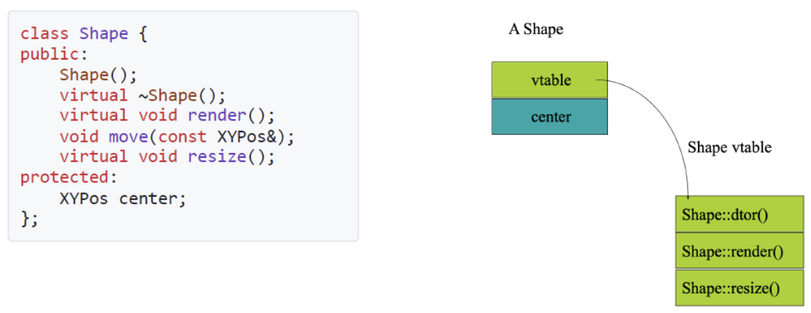
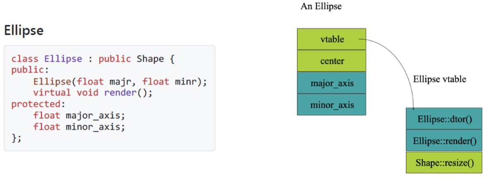
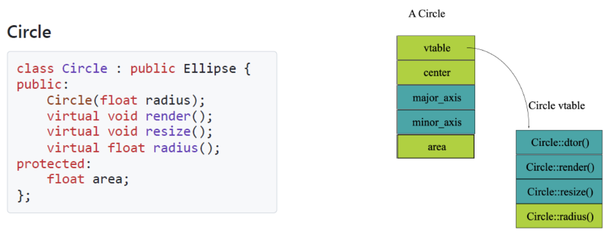

# 多态

1. **子类与子类型**：在需要**父类型/超类型**对象的地方，可以使用子类对象（称为**替换**）

    !!! abstract "Abstract"
        <mark class="cyan">如果继承方式为 **`#!cpp public`**，那么**替换成立**</mark>

    !!! example "Example"
        ```cpp
        class Animal {}
        class Dog : public Animal {}
        class Cat : public Animal {}
        void print(Animal *a) {}
        int main() {
            Animal *a1 = new Animal();
            Animal *a2 = new Cat();
            Animal *a3 = new Dog();
            print(a2);    // 可以使用子类对象
        }
        ```

2. **向上造型 up-casting**：将派生类的对象视为基类的对象 
    - **e.g.** 将 `Dog` 对象视为 `Animal` 对象

        ```cpp
        Dog dog;
        Animal* animal = &dog;  // 1
        Animal& animal = dog;   // 2
        ```

---
## 多态变量


1. **多态变量**：
    - <mark>只有**指针和引用**可以作为多态变量</mark>
    - 有静态类型与动态类型两种类型
    - 可以存放声明类型的对象，也可以存放声明类型的**子类型**对象
2. **静态类型与动态类型**
    - **静态类型**：变量在源代码中声明时所具有的类型（编译时）
    - **动态类型**：变量在运行时实际引用的对象的类型（运行时）
    - <mark>**e.g.**</mark> `#!cpp Shape *p = new Circle();` `p` 的静态类型是 `Shape`，动态类型是 `Circle`
3. **绑定** Binding：确定要调用哪个函数
    - **静态绑定**：根据<mark>**声明类型**</mark>调用函数，在<mark>编译时</mark>确定
    - **动态绑定**：根据<mark>对象的实际类型</mark>调用函数，在<mark>**运行时**</mark>确定

    !!! example "Example"
        ```cpp
        void render(Shape* p) {
            p->render();    // shape 不确定，在运行过程中才知道
        } 

        Ellipse ell(10, 20);
        ell.render();    // 静态绑定 -- Ellipse::render();
        Circle circ(40);
        circ.render();   // 静态绑定 -- Circle::render();
        render(&ell);    // 动态绑定 -- Ellipse::render();
        render(&circ);   // 动态绑定 -- Circle::render();
        ```

    !!! success "动态绑定的条件"
        1. 有继承关系
        2. **基类函数是 virtual**（只有虚函数才支持动态绑定）
        3. 用基类指针或引用调用
        4. 派生类**正确重写**该虚函数
        5. 没有对象切片（不能是 `Base b = d;`）

---
## **`#!cpp virtual`** 关键字

1. **非 `#!cpp virtual` 函数**：编译器生成对声明类型的**静态或直接调用**（执行速度更快）
2. **`#!cpp virtual` 函数**：
    - 可以在派生类中被透明地**重写**
    - 对象携带**虚函数表**，编译器检查这组函数并动态地调用正确的函数
    - 如果编译器在编译时已知该函数，它可以生成**静态调用**

    !!! warning "静态成员函数属于类本身，不属于某个具体对象，所以不能是虚函数，不能实现多态"

3. <span class="red">**工作原理**</span>
    - 如果一个类使用了 `#!cpp virtual` 关键字，编译器会生成一个**虚函数表 `vtable`**
        - `vtable` 中按照**声明**顺序存放所有虚函数的地址
    - 该类中会包含一个 **`vptr` 指针**，指向 `vtable`
        - <mark>在定义初始化和初始化列表**之前**被赋值</mark>
        - 只有一次赋值机会，之后该值**不会再改变**（参见 tip）
    - **继承**
        - 子类的 `vptr` 指向子类自己的 `vtable`
        - 子类 `vtable` 先**完整拷贝**一份父类的 `vtable`（地址指向父类函数地址），**重写的函数**覆盖父类函数地址，新添加的函数**添加到末尾**

    !!! info "Example"
        === "Shape"

            {style="width:80%;display: block;margin: 20px auto"}

        === "Ellipse"

            {style="width:80%;display: block;margin: 20px auto"}

        === "Circle"

            {style="width:80%;display: block;margin: 20px auto"}

    !!! tip "子类到父类的赋值：切割 slice"
        ```cpp
        Ellipse elly(20F, 40F);
        Circle circ(60F);
        elly = circ;
        elly.render();      // 调用的函数是 elly 的 render()
        ```

        1. 只有 `circ` 中能放入 `elly` 的部分会被复制（area 被丢弃）
        2. **`elly` 的 `vptr` 和 `vtable` **不会改变****
        3. <mark class="green">**这导致了对象本身不可以多态**</mark>

        !!! warning "指针"
            ```cpp
            // upcasting
            Ellipse* elly = new Ellipse(20F, 40F);
            Circle* circ = new Circle(60F);
            elly = circ;        // 指向的是一个 circle 对象
            elly->render();     // 调用的是 Circle::render()
            ```

4. **虚析构函数**

    ```cpp
    virtual Shape::~Shape() {}
    Shape *p = new Ellipse(100.0F, 200.0F); ...
    delete p;
    ```

    - <mark>如果类可能被继承，通常**将析构函数设为虚函数**</mark>
    - `delete` 时会查找 `vtable`，并调用对应的子类析构函数，再**自动调用**父类 `Shape` 的析构函数

    !!! warning "Warning"
        如果析构函数不是虚函数，则只会调用 `Shape::~Shape()`，而不会调用 `Ellipse::~Ellipse()`

        这会导致子类对象没有被正确析构，从而导致**内存泄漏**

!!! info "构造函数中虚函数的调用"
    ```cpp
    class A {
    public:
        A() { f(); }
        virtual void f() { cout << "A::f()"; }
    };
    class B : public A {
    public:
        B() { f(); }
        void f() { cout << "B::f()"; }
    };
    ```

    当构造 `B` 对象时，会先调用 `A` 的构造函数，然后调用 `B` 的构造函数，输出如下

    ```bash
    A::f()          # 调用 A 的构造函数：此时 vptr 指向 A 的虚函数表
    B::f()          # 调用 B 的构造函数：此时 vptr 指向 B 的虚函数表
    ```

---
## Override
1. **向上调用链**：当子类重写父类的虚函数时，并不想完全抛弃父类的功能，而是想在父类功能的基础上**添加新功能**

    ```cpp
    void Ellipse::render() {}
    void Circle::render() {
        Ellipse::render(); 
        cout << "Drawing a perfect circle based on radius!" << endl;
    }
    ```

2. **返回类型协变**

    - 假设 `B` 是从 `A` **公有**派生的，`B::f()` 可以返回 `A::f()` 的**返回类型的子类**
    - <mark>仅适用于**指针和引用**返回类型</mark>

    ```cpp
    class Expr {
    public:
        virtual Expr* newExpr();
        virtual Expr& clone();
        virtual Expr  self();
    };
    class BinaryExpr : public Expr {
    public:
        virtual BinaryExpr* newExpr(); // 允许 (Ok)
        virtual BinaryExpr& clone();   // 允许 (Ok)
        virtual BinaryExpr  self();    // 错误！(Error!) - 非指针或引用类型不支持放宽
    };
    ```

3. **函数重载与虚函数**

    ```cpp
    class Base {
    public:
        virtual void func();
        void func(int);
    };
    class Derived : public Base {
    public:
        void func() {}
        // using Base::func; // 将 Base 中所有的 func 重载版本都引入到 Derived 的作用域
        void func(int) {
            Base::func();       // 相当于手动重写
        }
    }
    ```

    - 如果重写了一个被重载的函数，那么**必须重写它的所有变体**，不能只重写其中一个
    - 如果没有全部重写，**其中的一些变体将会被隐藏**

!!! tip "Tips"
    1. 永远不要重新定义继承而来的**非虚函数**（非虚函数是静态绑定的）

    ??? example "Example"
        ```cpp
        class Base {
        public:
            void show() { cout << "Base::show"; } // 非虚函数
        };
        class Derived : public Base {
        public:
            void show() { cout << "Derived::show"; } // 重定义
        };

        Derived d;
        Base* p = &d;
        p->show(); // 输出 Base::show!
        ```

    2. 永远不要重新定义继承而来的**默认参数值**（静态绑定）

    ??? example "Example"   
        ```cpp
        class Base {
        public:
            virtual void func(int x = 10) { cout << "Base: " << x; }
        };

        class Derived : public Base {
        public:
            void func(int x = 20) override { cout << "Derived: " << x; }
        };

        Base* p = new Derived();
        p->func(); // 输出：Derived: 10
        ```

---
## 抽象类
1. **纯虚函数**：在类中仅定义接口，没有实现的函数

    ```cpp
    virtual void func() = 0;
    ```

2. **抽象基类**：包含纯虚函数的类
    - 抽象基类<mark>**不能被实例化**</mark>，必须派生出新的子类
    - 在子类中需要**实现**抽象基类的纯虚函数，否则仍然是抽象类，无法实例化