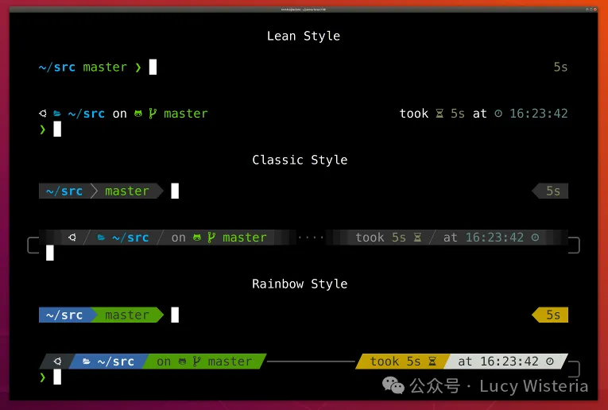

# 公众号

    

        
    

    

        
Lucy Wisteria

        
在这里，把读过的书、学到的课，和路过的人间，一并讲给未来的自己听。

    

    

        
        扫码关注我呀
    

    <a href="https://mp.weixin.qq.com/s/RI7IBw2aW_g7QcpgaQnntA" class="card-link">
        

            
        

        

            
Lucy Wisteria's Notebook

            

                本人的笔记网站哈，欢迎来参观留言～
                <i class="fa-regular fa-clock"></i> 2026-03-06 14:28
            

        

    </a>

    <a href="https://mp.weixin.qq.com/s/NA8GaJarscswi8WTQzTiHg" class="card-link">
        

            
        

        

            
【macOS 终端】Oh My Zsh + Powerlevel10k，让你的 Mac 终端告别“黑白时代”

            

                macOS 终端美化基础篇
                <i class="fa-regular fa-clock"></i> 2026-03-07 08:00
            

        

    </a>

    <a href="https://mp.weixin.qq.com/s/AvtBrMiciJ1LcBJyP6cf0g?scene=1" class="card-link">
        

            
        

        

            
【macOS 终端】用 Powerlevel10k 玩转 macOS 终端，从“美化”到“完全掌控”

            

                macOS 终端美化进阶篇
                <i class="fa-regular fa-clock"></i> 2026-03-08 17:44
            

        

    </a>

    <a href="https://mp.weixin.qq.com/s/4J5fessgcLF5KsRIkU9o7w" class="card-link">
        

            
        

        

            
【macOS 终端】解锁 Oh My Zsh 插件与 Alias，打造 macOS 终端顶级生产力

            

                macOS 终端效率提升篇
                <i class="fa-regular fa-clock"></i> 2026-03-09 12:05
            

        

    </a>

    <a href="https://mp.weixin.qq.com/s/trHQzfHrVmo4lV0ioSst9w" class="card-link">
        

            
        

        

            
【六级词汇】六级高频词汇速记（A）

            

                六级词汇
                <i class="fa-regular fa-clock"></i> 2026-03-12 10:00
            

        

    </a>

    <a href="https://mp.weixin.qq.com/s/4bP063QOdrIOYAUO5hUWGA" class="card-link">
        

            
        

        

            
【六级词汇】六级高频词汇速记（B）

            

                六级词汇
                <i class="fa-regular fa-clock"></i> 2026-03-15 16:00
            

        

    </a>

    <a href="https://mp.weixin.qq.com/s/3Jq_Y-jaHK9dmoMyoayVHw" class="card-link">
        

            
        

        

            
【六级词汇】六级高频词汇速记（C）

            

                六级词汇
                <i class="fa-regular fa-clock"></i> 2026-03-20 10:01
            

        

    </a>

    <a href="https://mp.weixin.qq.com/s/sKcOSf9JuiUkXQCUbRvBlA" class="card-link">
        

            
        

        

            
【六级词汇】六级高频词汇速记（D）

            

                六级词汇
                <i class="fa-regular fa-clock"></i> 2026-03-22 10:02
            

        

    </a>

